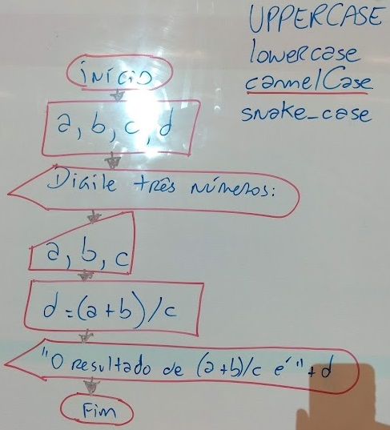

# Aula03 - Fluxograma
## 1.3. Fluxogramas
Representação gráfica de algoritmos
### Utilizade
Facilitar o entendimento de um programa ou processo de trabalho

## Elementos de um fluxograma básico


## Lousa


### Correção da primeira lista de exercícios
- "Desenvolva um programa que leia três variáveis (a, b, c) e resolva a expressão: ( a + b ) / c"
- ex01.c
```c
#include <stdio.h>
#include <locale.h>
int main(){
	setlocale(LC_ALL,"");
	int a, b, c;
	printf("Digite três números:\n");
	scanf("%d %d %d", &a, &b, &c);
	printf("(%d + %d)/%d = %d", a, b, c, (a + b) / c);	
}
```
- Fluxograma
- 
- "Desenvolva um programa que leia a velocidade de um carro (km/h) e a distância a ser percorrida (km) por ele. Calcule e apresente na tela, quanto tempo (horas) será necessário para o carro percorrer a distância informada."
- ex02.c
```c
#include <stdio.h>
#include <locale.h>
int main(){
	setlocale(LC_ALL,"");
	int velocidade, distancia;
	float tempo;
	printf("Digite a velocidade em Km/h e a distância em Km da sua viágem:\n");
	scanf("%d %d", &velocidade, &distancia);
	tempo = distancia * 1.0 / velocidade * 1.0;
	printf("Esta viagem lavará %.1f horas", tempo);
	return 0;
}
```
- "Desenvolva um programa que leia o nome e o salário de uma pessoa, depois leia o valor do índice percentual (%) de reajuste do salário. Calcule e apresente na tela, o valor do novo salário e o nome da pessoa."
- ex03.c
```c
#include <stdio.h>
#include <locale.h>
int main(){
	setlocale(LC_ALL,"");
	char nome[20];
	float sal, reajuste, novoSal;
	printf("Digite o 1º nome e o salário do funcionário:\n");
	scanf("%s %f", &nome, &sal);
	printf("Digite o percentual de reajuste:\n");
	scanf("%f", &reajuste);
	novoSal = sal + sal * reajuste / 100;
	printf("O salário de %s reajustado será de %.2f", nome, novoSal);
	return 0;
}
```
- Desenvolva um programa que leia o nome de um time de futebol, o número de vitórias e o número de empates. O programa deverá calcular e apresentar na tela, o nome do time e o total de pontos. Lembrando que a vitória vale 3 pontos e o empate vale 1 ponto.
- ex04.c
```c
#include <stdio.h>
#include <locale.h>
int main(){
	setlocale(LC_ALL,"");
	char time[30];
	int vitorias, empates, total;
	printf("Digite do nome do time:\n");
	scanf("%s",&time);
	printf("Digite o nº de vitórias:\n");
	scanf("%d", &vitorias);
	printf("Digite o nº de empates:\n");
	scanf("%d", &empates);
	total = vitorias * 3 + empates;
	printf("O total de pontos do time %s é %d", time, total);
	return;
}
```
- Desenvolva um programa que leia um número ”n” inteiro, positivo e diferente de zero e apresente na tela: n – 1, e também n + 1.
- ex5.c
```c
#include <stdio.h>
#include <locale.h>
int main(){
	setlocale(LC_ALL,"");
	int x, x1, x2;
	printf("Digite um númro inteiro:\n");
	scanf("%d", &x);
	x1 = x - 1;
	x2 = x + 1;
	printf("O número digitado %d - 1 = %d e + 1 = %d ", x, x1, x2);
	return;
}
```
- Sabendo-se que a velocidade de cruzeiro de um avião 747-300 é de 900 km/h, faça um programa que leia uma distância (km), calcule e apresente na tela, quanto tempo (horas) será necessário para um 747-300 sobrevoar a distância informada.
- ex06.c
```c
#include <stdio.h>
#include <locale.h>
int main(){
	setlocale(LC_ALL,"");
	int distancia;
	printf("Digite a distância em km do vôo:\n");
	scanf("%d", &distancia);
	printf("O vôo vai durar %.1f horas", distancia / 900.0 );
	return;
}
```
- Um caminhão consegue transportar 18 toneladas de laranjas em uma viagem que faz entre a fazenda e a fábrica de suco de laranja. Um alqueire de terra produz em média 250 toneladas de laranjas. Faça um programa que leia quantos caminhões e quantos alqueires uma fazenda produtora de laranjas possui, calcule e apresente na tela quantas viagens de caminhão serão necessárias para transportar toda a colheita de laranjas.
- ex7.c
```c
#include <stdio.h>
#include <locale.h>
int main(){
	setlocale(LC_ALL,"");
	int caminhoes, alqueires, viagens, inexato;
	int TONALQUEIRE = 250;
	int TONCAMINHAO = 18;
	printf("Quantos alqueires produtivos sua propriedade possui:\n");
	scanf("%d", &alqueires);
	printf("Quantos caminhões você possui:\n");
	scanf("%d", &caminhoes);
	viagens = (alqueires * TONALQUEIRE) / (caminhoes * TONCAMINHAO);
	printf("Será necessário %d viagens no máximo, para tranportar sua produção.", viagens + 1);
	return;
}
```

## Desafio - Caixa eletrônico
Desenvolva um programa que solicite ao usuário que digite um valor em dinheiro ex: R$ 272,00
E exiba quantas notas serão necessárias para o montante
1 nota de 200
1 nota de 50
1 nota de 20
1 nota de 2
OBS: O valor será inteiro e multiplo de 2 por não haver notas de 1 real, não é necessário colocar moedas, não deve ser utilizado o comando condicional **if**.