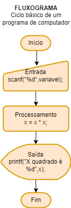
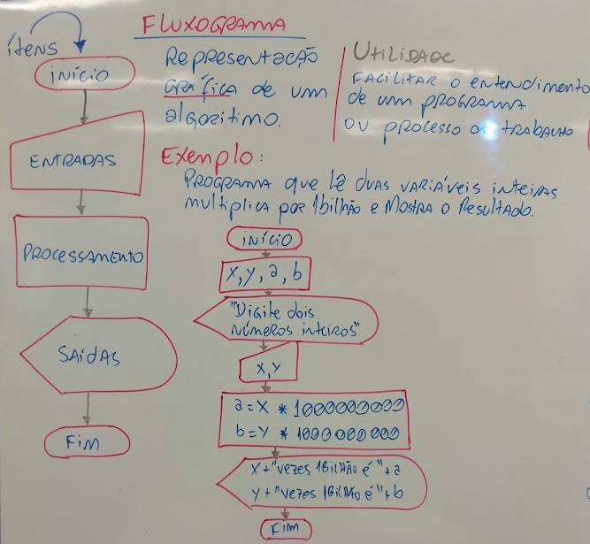

# Aula03 - Fluxograma
## 1.3. Fluxogramas
Representação gráfica de algoritmos
### Utilizade
Facilitar o entendimento de um programa ou processo de trabalho

## Elementos de um fluxograma básico


## Lousa


### Correção da primeira lista de exercícios
- "Desenvolva um programa que leia três variáveis (a, b, c) e resolva a expressão: ( a + b ) / c"
- ex01.c
```c
#include <stdio.h>
#include <locale.h>
int main(){
	setlocale(LC_ALL,"");
	int a, b, c;
	printf("Digite três números:\n");
	scanf("%d %d %d", &a, &b, &c);
	printf("(%d + %d)/%d = %d", a, b, c, (a + b) / c);	
}
```
- Fluxograma
- 
- "Desenvolva um programa que leia a velocidade de um carro (km/h) e a distância a ser percorrida (km) por ele. Calcule e apresente na tela, quanto tempo (horas) será necessário para o carro percorrer a distância informada."
- ex02.c
```c
#include <stdio.h>
#include <locale.h>
int main(){
	setlocale(LC_ALL,"");
	int velocidade, distancia;
	float tempo;
	printf("Digite a velocidade em Km/h e a distância em Km da sua viágem:\n");
	scanf("%d %d", &velocidade, &distancia);
	tempo = distancia * 1.0 / velocidade * 1.0;
	printf("Esta viagem lavará %.1f horas", tempo);
	return 0;
}
```
- "Desenvolva um programa que leia o nome e o salário de uma pessoa, depois leia o valor do índice percentual (%) de reajuste do salário. Calcule e apresente na tela, o valor do novo salário e o nome da pessoa."
- ex03.c
```c
#include <stdio.h>
#include <locale.h>
int main(){
	setlocale(LC_ALL,"");
	char nome[20];
	float sal, reajuste, novoSal;
	printf("Digite o 1º nome e o salário do funcionário:\n");
	scanf("%s %f", &nome, &sal);
	printf("Digite o percentual de reajuste:\n");
	scanf("%f", &reajuste);
	novoSal = sal + sal * reajuste / 100;
	printf("O salário de %s reajustado será de %.2f", nome, novoSal);
	return 0;
}
```