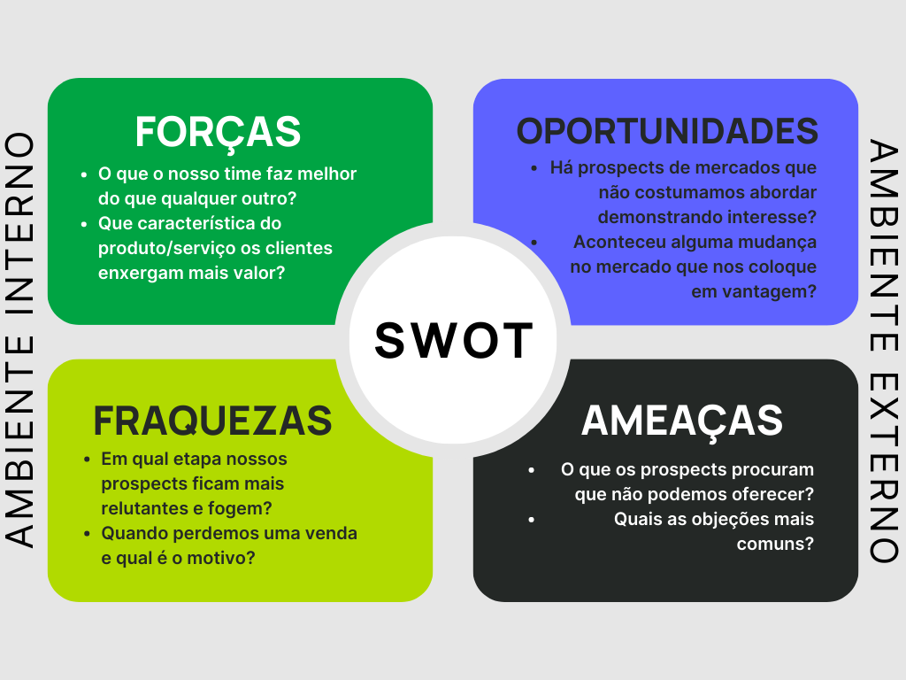
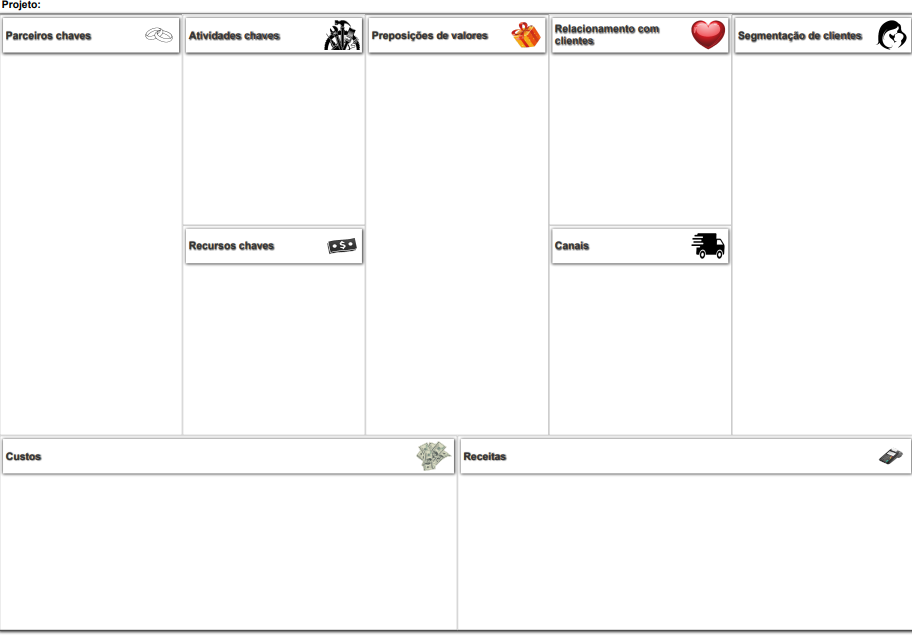

# Aula05 - Design Thinking
Abordagem de desenvolvimento que consiste em criar modelos do que será o **serviço** ou o **produto**, para avaliar se é **viável**, **desejável e praticável**. Trata-se de concretizar as ideias, para que outras pessoas tenham condições de ver, criticar e contribuir.

## Conhecimentos
- 7 Design Thinking
	- 7.1. Definição
	- 7.2. Etapas
		- 7.2.1.Empatia
		- 7.2.2.Ideação
		- 7.2.3.Prototipação
		- 7.2.4.Teste
		- 7.2.5.Implementação

## Viabilidade
Analisar os riscos do investimento no projeto, uma das ferramentas que podemos utilizar inicialmente é a matriz **SWOT** ou **FOFA** em português

## Empatia
Capacidade de se identificar com outra pessoa, de sentir o que ela sente, de querer o que ela quer, de apreender do modo como ela apreende etc.
## Ideação
Ideação é um processo criativo que se refere à geração de ideias e soluções para problemas. É a fase inicial do processo criativo, na qual ideias são geradas e exploradas para encontrar uma solução criativa para um problema.
- Se a ideia é madura o suficiente, se torna uma possibilidade de **Empreendimento**, podento tornar-se uma Startup caso encontre parceiros dispostos a investir, neste caso precisamos modelar um negócio, e podemos utilizar a ferramenta [Quadro Canvas](https://wellifabio.github.io/canvas/) para Negócios.

## Prototipação
- Figma
- Diagrama de atividades
## Teste (Testes de software)
- Teste de mesa
- Teste unitário
- Teste de desempenho
- Ferramenta de testes automatizados [Selenium](https://www.selenium.dev/)
## Implementação
- IDE Ambiente integrado de desenvolvimento
- SDK Kit de desenvolvimento de software